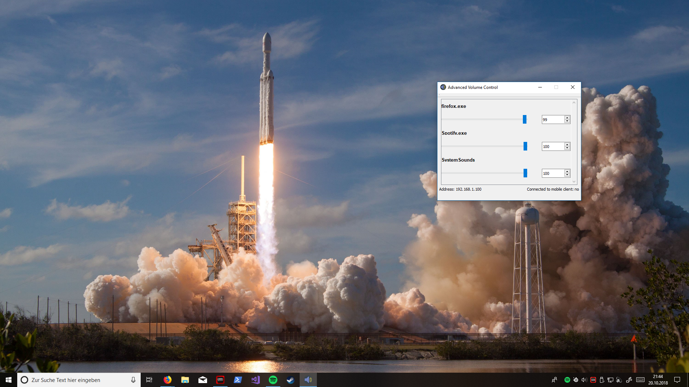

# Advanced Volume Control
Advanced Volume Control is a Windows 10 application, with which you can control all your Windows 10 audio sessions.

You can also connect your Android device to this application to control it from there. For this you need the Android app from the Google Play Store.

# Downloads

## Windows 10 application

[Get the Windows 10 application from Sourceforge](https://sourceforge.net/projects/windows10volumecontrol/)

## Android app

[Get the Android app from Sourceforge](https://play.google.com/store/apps/details?id=com.m1smr.avc)
